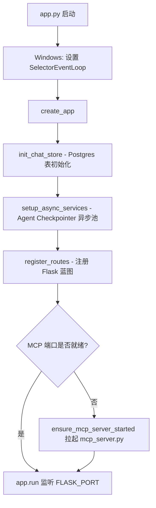
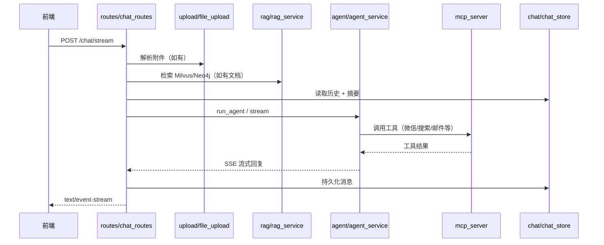

# 项目结构与启动说明

> 快速上手见 [README.md](../README.md) · Task Harness 设计见 [TASK_HARNESS.md](./TASK_HARNESS.md)

## 目录概览

```
前端AI发消息/
├── app.py                  # Flask Web 主入口
├── mcp_server.py           # MCP 工具服务入口（微信/邮件/文件/搜索等）
├── requirements.txt        # Python 依赖
├── requirements-postgres.txt
├── docker-compose.yml      # Docker 编排（Redis / Milvus / Neo4j / Web）
├── Dockerfile
├── docker-entrypoint.sh
├── README.md
│
├── config/                 # 配置与环境变量
├── core/                   # 核心基础设施
├── agent/                  # LangGraph Agent 与 HITL
├── chat/                   # 聊天存储与摘要
├── rag/                    # RAG / GraphRAG 检索
├── app_mcp/                # MCP 生命周期与工具实现
├── parsing/                # 文档与图片解析
├── upload/                 # 文件上传处理
├── llm/                    # 智谱 LLM 封装
├── routes/                 # Flask 路由（API 蓝图）
├── template/               # 前端 HTML 模板
├── uploads/                # 用户上传文件（运行时）
├── exports/                # Excel 等导出文件（运行时）
├── data/                   # 静态数据文件
├── scripts/                # 运维与测试脚本
├── lib/                    # 第三方二进制资源
└── docs/                   # 项目文档
```

---

## 各文件夹说明

### 根目录（启动与部署）

| 文件 | 说明 |
|------|------|
| `app.py` | Flask 应用入口：初始化聊天存储、异步服务、路由，并可选拉起 MCP 子进程 |
| `mcp_server.py` | FastMCP 服务：注册微信、文件系统、邮件、Excel 导出、联网搜索等工具 |
| `docker-compose.yml` | 一键启动 etcd / MinIO / Milvus / Redis / Neo4j / Web |
| `docker-entrypoint.sh` | 容器启动脚本：等待 Redis/Milvus → 后台启动 MCP → 运行 `app.py` |

### `config/` — 配置

| 文件 | 说明 |
|------|------|
| `env_config.py` | 从根目录 `.env` 加载环境变量，提供 `ZHIPUAI_API_KEY` 等 |
| `app_config.py` | 项目路径（`BASE_DIR`）、Flask/MCP/Postgres/聊天摘要/HITL 等运行时配置 |

### `core/` — 核心基础设施

| 文件 | 说明 |
|------|------|
| `async_runner.py` | 后台 asyncio 事件循环，供 Flask 同步路由调用异步 Agent |
| `app_utils.py` | 通用工具（错误格式化等） |
| `api_throttle.py` | API 限流与重试（智谱 Embedding、LLM 调用） |

### `agent/` — Agent 引擎

| 文件 | 说明 |
|------|------|
| `agent_service.py` | LangGraph ReAct Agent，连接 MCP 工具，支持 HITL 人机确认 |
| `agent_stream.py` | Agent 流式输出（SSE）与 HITL 中断恢复 |
| `agent_state.py` | Agent 运行状态与 HITL 中断合成 |
| `agent_checkpointer.py` | LangGraph Postgres Checkpointer（会话级 Agent 状态持久化） |
| `harness.py` | **Task Harness**：pre/post hooks、阶段 gate、重锚定、续跑持久化 |
| `planner.py` | 复杂任务检测 + LLM 步骤规划 |
| `task_state.py` | Harness 状态 Schema、gather/process/deliver 阶段与工具白名单 |
| `task_checklist.py` | 子任务 checklist、「继续」识别、自动续跑 nudge |
| `task_continue.py` | 外发交付检测、重复外发拦截 |
| `hitl_config.py` | 需用户确认的工具名与前端展示文案 |
| `hitl_tools.py` | HITL 工具包装与中断解析 |

> Task Harness 设计原理见 [TASK_HARNESS.md](./TASK_HARNESS.md)

### `chat/` — 聊天存储

| 文件 | 说明 |
|------|------|
| `chat_store.py` | 存储门面：Postgres 权威写入 + Redis 热缓存 |
| `chat_postgres.py` | PostgreSQL 会话/消息/上传元数据 |
| `chat_redis.py` | Redis 缓存层 |
| `chat_helpers.py` | 消息构建、MCP 附件提取、工具调试信息 |
| `chat_summary.py` | 长对话自动摘要（智谱小模型） |

### `rag/` — 检索增强

| 文件 | 说明 |
|------|------|
| `rag_service.py` | RAG 模式路由（普通 RAG / GraphRAG） |
| `rag_milvus.py` | 文档分块、Embedding、Milvus 向量存储与检索 |
| `graphrag.py` | GraphRAG：LLM 实体关系抽取 → Neo4j 图谱 → 混合检索 |
| `milvus_naming.py` | Milvus 库/集合命名规范 |
| `neo4j_store.py` | Neo4j 图谱读写（社区版单库模式） |

### `app_mcp/` — MCP 集成

> 命名为 `app_mcp` 而非 `mcp`，避免与 pip 包 `mcp`（MCP 客户端 SDK）冲突。

| 文件 | 说明 |
|------|------|
| `mcp_lifecycle.py` | MCP 子进程启停、端口探测、微信工具版本检测 |
| `wechat_mcp.py` | 微信发消息/读记录/发文件（Windows + wxauto4） |
| `filesystem_mcp.py` | 本地目录列表、文件读取、glob 搜索 |
| `document_loader_mcp.py` | AWS Document Loader MCP 远程解析 |
| `wx_patch.py` | wxauto4 兼容性补丁 |

### `parsing/` — 文档解析

| 文件 | 说明 |
|------|------|
| `document_parse_local.py` | 本地 PDF/Office 解析（pdfplumber / markitdown） |
| `vision_parse.py` | 图片 GLM-4V 描述 |
| `generate_docx.py` | 从 `data/interview_data.json` 生成面试文档 |

### `upload/` — 上传

| 文件 | 说明 |
|------|------|
| `file_upload.py` | 上传保存、类型检测、解析调度（本地/MCP/视觉） |

### `llm/` — 大模型

| 文件 | 说明 |
|------|------|
| `llm_zhipu.py` | 智谱 Chat / Summary LLM 工厂，含限流重试 |

### `routes/` — HTTP 路由

| 文件 | 说明 |
|------|------|
| `pages.py` | 页面与静态导出文件访问 |
| `chat_routes.py` | 对话、上传、会话、RAG、流式 SSE |
| `send_routes.py` | 直接发微信/邮件 API |
| `service_routes.py` | MCP 服务启停与状态 |

### 其他目录

| 目录 | 说明 |
|------|------|
| `template/` | 前端页面 `1.html` |
| `uploads/` | 按 session_id 存放用户上传文件 |
| `exports/` | MCP 导出的 Excel、生成的 docx 等 |
| `data/` | 静态 JSON 等（如 `interview_data.json`） |
| `scripts/` | `install_doc_deps.bat`（文档解析依赖）、`testwx.py`（微信测试）、`my_neo4j.py`（Neo4j 示例） |
| `lib/` | 第三方资源（如 `postgresql-42.7.11.jar`） |
| `docs/` | 项目文档（[STRUCTURE.md](./STRUCTURE.md)、[TASK_HARNESS.md](./TASK_HARNESS.md)） |

---

## 启动流程

### 方式一：本地开发（Windows 推荐）

**前置条件**

1. 安装 Python 3.12+ 与依赖：`pip install -r requirements.txt`
2. 如需 Postgres 聊天存储：`pip install -r requirements-postgres.txt`
3. 在项目根目录创建 `.env`，至少配置：
   ```
   ZHIPUAI_API_KEY=你的密钥
   ```
4. 按需启动外部服务：Redis、Milvus、Neo4j、PostgreSQL（见 `.env` 中对应 URI）

**启动步骤**

```powershell
# 0. 复制环境变量模板并填入 ZHIPUAI_API_KEY
copy .env.example .env

# 1.（可选）安装文档解析依赖
scripts\install_doc_deps.bat

# 2. 一键启动（推荐；MCP 未运行时 app.py 会自动尝试拉起）
scripts\start.bat

# 或手动分步：
# python mcp_server.py
# python app.py
```

**`app.py` 内部启动顺序**



### 方式二：Docker Compose（完整栈）

```bash
# 在项目根目录，确保 .env 已配置 ZHIPUAI_API_KEY 等
docker compose up -d
```

**`docker-entrypoint.sh` 流程**

1. 等待 Redis 可达
2. 等待 Milvus 可达
3. 后台启动 `python mcp_server.py`
4. 等待 MCP 端口（默认 8090）就绪
5. `exec python app.py` 启动 Web

访问：`http://localhost:5001`

### 方式三：仅 MCP 服务

```bash
python mcp_server.py
```

默认监听 `MCP_HOST:MCP_PORT`（默认 `localhost:8090`），提供微信、文件、邮件、搜索等工具供 Agent 调用。

---

## 请求处理流程（对话）



---

## 环境变量速查

| 变量 | 默认值 | 说明 |
|------|--------|------|
| `ZHIPUAI_API_KEY` | — | 智谱 API 密钥（必填） |
| `FLASK_HOST` / `FLASK_PORT` | `0.0.0.0` / `5001` | Web 服务地址 |
| `MCP_HOST` / `MCP_PORT` | `localhost` / `8090` | MCP 服务地址 |
| `POSTGRES_URI` | — | Postgres 连接串（聊天 + Checkpointer） |
| `REDIS_HOST` / `REDIS_PORT` | `127.0.0.1` / `6379` | Redis 缓存 |
| `MILVUS_URI` | `http://127.0.0.1:19530` | Milvus 向量库 |
| `NEO4J_URI` | — | Neo4j 图谱（GraphRAG） |
| `TAVILY_API_KEY` | — | 联网搜索（MCP web_search） |

完整配置见 `config/app_config.py` 与 [`.env.example`](../.env.example)。

---

## 开发约定

- **根目录** 仅保留启动文件（`app.py`、`mcp_server.py`）与部署配置
- **业务代码** 按职责放入对应包目录，使用 `包名.模块名` 导入，例如：
  ```python
  from config.app_config import BASE_DIR
  from chat.chat_store import save_message
  from agent.agent_service import run_agent
  ```
- **`BASE_DIR`** 始终指向项目根目录，运行时目录 `uploads/`、`exports/`、`template/` 均相对根目录
