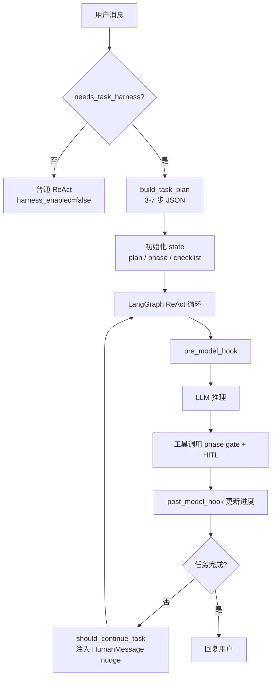

# Task Harness 设计文档

Task Harness 是本项目的**复杂任务编排层**，在 LangGraph ReAct Agent 之上增加：任务检测、LLM 规划、三阶段工具 gate、上下文裁剪与重锚定、自动续跑。目标是解决纯 ReAct 在多步任务中常见的 **早停、乱调工具、口头承诺但不执行、重复外发** 等问题。

相关代码：

| 模块 | 职责 |
|------|------|
| `agent/planner.py` | 启发式检测 + LLM 生成步骤计划 |
| `agent/task_state.py` | 阶段定义、允许工具集合、状态 Schema |
| `agent/harness.py` | pre/post hooks、phase gate、重锚定、持久化 |
| `agent/task_checklist.py` | checklist、续跑 nudge、「继续」识别 |
| `agent/task_continue.py` | 外发交付检测、重复发送拦截 |

---

## 1. 为什么需要 Harness

纯 ReAct Agent 在「搜索 → 整理 → 发邮件/微信」类任务上常见失败模式：

| 问题 | 表现 | Harness 对策 |
|------|------|--------------|
| **早停** | 搜完就回复，不做表格/外发 | `should_continue_task` 注入续跑 nudge |
| **口头交付** | 说「我将发送邮件」但不调 `send_email` | `should_continue_deliver` 专门检测 |
| **阶段错乱** | gather 阶段就调用 `send_email` | phase gate 按阶段限制工具 |
| **目标漂移** | 长上下文后忘记原始指令 | trim + 每轮 SystemMessage 重锚定 |
| **重复外发** | 同一轮多次 `send_email` | `_deliver_done` + duplicate block |

简单单轮问答（如「你好」「解释这段代码」）不应走 Harness，因此有 **启发式开关** `needs_task_harness()`。

---

## 2. 整体流程



### 2.1 启用条件

由环境变量 `AGENT_TASK_HARNESS=1`（默认开启）与 `needs_task_harness()` 共同决定。

启发式信号（`agent/planner.py`）包括：

- 附件数量、文本长度
- 多步关键词（「然后」「接着」「最后」等）
- 工具链关键词（「搜索」「发邮件」「导出」等）
- 邮件地址 / 外发模式
- 「搜索 + 外发」组合

信号数 ≥ `AGENT_TASK_HARNESS_MIN_SIGNALS`（默认 1）时启用。

### 2.2 计划生成

启用后调用小模型（`make_summary_llm()`）生成 JSON 数组计划，解析失败时使用 `_fallback_plan()` 默认三步。

计划约束（`PLANNER_SYSTEM`）：

1. 信息收集在前，整理居中，外发/导出在最后
2. 每步一句话、可验证
3. 仅输出 JSON，无 markdown

---

## 3. 三阶段模型（gather / process / deliver）

定义于 `agent/task_state.py`：

| 阶段 | 含义 | 典型工具 |
|------|------|----------|
| **gather** | 信息收集 | `web_search`, `web_search_batch`, `read_local_file`, `get_current_time`, … |
| **process** | 整理加工 | gather 工具 + `format_pretty_table` |
| **deliver** | 外发交付 | process 工具 + `send_email`, `send_wechat_*`, `export_to_excel` |

当前阶段由 **当前 plan 步骤文本** 推断（`infer_phase_from_step`），关键词如「发邮件」「导出」→ deliver，「表格」「汇总」→ process。

`plan_index` 由已完成工具轮数推算（`compute_plan_index` = `count_tool_rounds`，上限为 `len(plan)-1`）。

### 3.1 Phase Gate

`wrap_tools_with_phase_gate()` 包装每个 MCP 工具：

- `harness_enabled=false` → 全部放行
- 否则检查 `tool.name in allowed_tools_for_phase(current_phase)`
- 不允许时返回 `⛔ 工具 xxx 在当前阶段不可用...` 作为 ToolMessage
- 同一工具连续被拒绝 `AGENT_PHASE_GATE_MAX_RETRIES`（默认 3）次 → **放弃该工具**，提示 Agent 用 Markdown 直接回复

Gate 读取 `_run_task_context[thread_id]`，由 `pre_model_hook` 每轮同步。

### 3.2 与 HITL 的关系

Phase gate 控制 **能不能调**；HITL 控制 **调了要不要用户点确认**。

外发类工具同时在 `DELIVER_TOOLS` 与 `HITL_TOOL_NAMES` 中。典型顺序：

```
Agent 调用 send_email
  → phase gate 检查（须在 deliver 阶段）
  → HITL interrupt（前端审批卡片）
  → 用户确认 → resume → 真正执行
```

HITL resume 时会注入重锚定 SystemMessage（`format_reanchor_summary`），避免中断后偏离计划。

---

## 4. pre_model_hook / post_model_hook

注册于 LangGraph Agent（`agent_service.py` → `create_react_agent`）。

### 4.1 pre_model_hook 职责

1. 根据 messages 更新 `plan_index`、`task_phase`、`step_checklist`
2. 同步 `_run_task_context`、abandoned tools、deliver 完成标记
3. 若目标含外发但尚未 deliver → 强制推进到 deliver 阶段
4. **`trim_messages_for_llm`**：保留首条 HumanMessage + 最近 N 条（`AGENT_LLM_CONTEXT_MESSAGES`，默认 10）
5. 构造 **`llm_input_messages`**：首条 SystemMessage 重锚定 + trim 后的 messages
6. 每 `AGENT_REANCHOR_EVERY_N_TOOLS` 轮工具后插入进度检查 SystemMessage

重锚定内容（`build_reanchor_text`）包含：原始目标、计划清单、当前步骤、阶段、允许工具列表。

### 4.2 post_model_hook 职责

工具执行后再次更新 `plan_index`、checklist、`task_status`（全部步骤完成 → `done`）。

---

## 5. 自动续跑

Agent 给出文本回复但未完成任务时，`should_continue_task()`（`task_checklist.py`）可能返回 nudge 字符串，作为 **HumanMessage** 注入下一轮。

触发条件（简化）：

- 有非空 assistant 回复
- 无 pending tool calls
- Harness 启用且 `task_plan_incomplete`（plan 未完成或 deliver 未执行）
- 或 Agent 回复匹配「接下来我将搜索/发送…」（`assistant_promised_next_step`）
- 或 `should_continue_deliver` 检测到口头承诺外发

续跑上限：`MAX_TASK_CONTINUATIONS`（默认 5，环境变量可配）。

续跑 nudge 示例结构（`build_task_nudge`）：

```
【系统自动续跑】复杂任务尚未全部完成...
原始目标：...
进度清单：
✓ 1. ...
→ 2. ...
✗ 3. ...
当前应完成：第 2 步 — ...
```

---

## 6. 「继续」跨轮恢复

用户发送「继续」「接着做」等（`is_continue_message`）时：

1. `resolve_user_goal` 回溯到首条复杂任务指令
2. `build_initial_agent_state` 从 Redis 读取 `task_harness_meta`
3. 恢复 `plan`、`plan_index`、`task_phase`、checklist
4. 若 Redis 无 meta 且仍需 Harness → 重新 `build_task_plan`

这使多轮对话中任务可跨 **用户新消息** 延续，而不依赖 LangGraph checkpoint 中的完整 message 历史。

---

## 7. 状态存储与 Checkpoint 策略

### 7.1 TaskHarnessState 字段

```python
# agent/task_state.py
user_goal, plan, plan_index, task_phase,
harness_enabled, completed_steps, step_checklist, task_status
```

### 7.2 持久化位置

| 数据 | 存储 | 说明 |
|------|------|------|
| 聊天消息 | Postgres + Redis | 权威 + 热缓存 |
| Task harness meta | **Redis only** | `chat_store.save_task_harness_meta` |
| LangGraph checkpoint | Postgres / MemorySaver | HITL interrupt 恢复 |
| `_run_task_context` | **进程内存** | phase gate 运行时读取 |
| `_phase_gate_attempts` / `_abandoned_tools` | **进程内存** | gate 计数 |
| `_deliver_done` | **进程内存** | 防重复外发 |

### 7.3 每轮 reset thread 的原因

`prepare_agent_invoke()` 在新用户消息时调用 `reset_agent_thread(session_id)`（非 HITL resume、非「继续」场景），并清空 harness meta。

原因：聊天历史已由 `chat_store` 维护，LangGraph checkpoint 若累积完整 messages 会导致 **重复注入**；每轮用 `lc_messages` 重建 state 更可控。

例外：

- **HITL resume**：`fresh_thread=False`，从 checkpoint 恢复 interrupt 状态
- **「继续」**：`fresh_thread=True` 但 **保留** Redis harness meta

---

## 8. 前端集成

SSE 事件 `task_harness`（`task_harness_event_payload`）推送：

```json
{
  "type": "task_harness",
  "user_goal": "...",
  "plan": ["步骤1", "步骤2"],
  "plan_index": 1,
  "task_phase": "process",
  "step_checklist": [
    {"index": 0, "step": "...", "done": true, "current": false},
    {"index": 1, "step": "...", "done": false, "current": true}
  ]
}
```

前端据此渲染进度 checklist（✓ / → / ✗）。

---

## 9. 环境变量

| 变量 | 默认 | 说明 |
|------|------|------|
| `AGENT_TASK_HARNESS` | `1` | 总开关 |
| `AGENT_TASK_HARNESS_MIN_SIGNALS` | `1` | 启用 Harness 所需最少启发式信号数 |
| `AGENT_LLM_CONTEXT_MESSAGES` | `10` | 送入 LLM 的最近消息条数 |
| `AGENT_REANCHOR_EVERY_N_TOOLS` | `3` | 每 N 轮工具插入进度检查 |
| `AGENT_PHASE_GATE_MAX_RETRIES` | `3` | 阶段 gate 放弃阈值 |
| `MAX_TASK_CONTINUATIONS` | `5` | 单轮内自动续跑上限 |
| `AGENT_RECURSION_LIMIT` | `100` | LangGraph 递归深度 |

---

## 10. 已知限制与后续方向

1. **Harness meta 仅存 Redis**：Redis 清空后跨轮「继续」丢失计划；可迁移至 Postgres。
2. **Phase gate 状态在内存**：进程重启 mid-run 后 gate 计数丢失。
3. **plan_index 按工具轮数估算**：若一步需多次工具调用，进度可能提前推进；依赖重锚定文案纠正。
4. **阶段由步骤文本关键词推断**：计划措辞不当可能导致阶段误判。
5. **无自动化 eval**：复杂任务完成率尚未量化回归。

---

## 11. 调试建议

1. 终端开启 `LOG_LLM_PROMPT=1` 查看重锚定 SystemMessage 是否注入
2. 观察 SSE `task_harness` 事件中 `plan_index` / `task_phase` 变化
3. ToolMessage 以 `⛔` 开头表示 phase gate 拒绝
4. 关闭 Harness 对比：`AGENT_TASK_HARNESS=0`
5. 调低 `AGENT_TASK_HARNESS_MIN_SIGNALS` 可让更多任务进入 Harness（调试时用）

---

## 12. 与其他文档的关系

- 项目目录与启动：[STRUCTURE.md](./STRUCTURE.md)
- 快速上手与 Demo：[../README.md](../README.md)
- 环境变量完整列表：[../.env.example](../.env.example)
